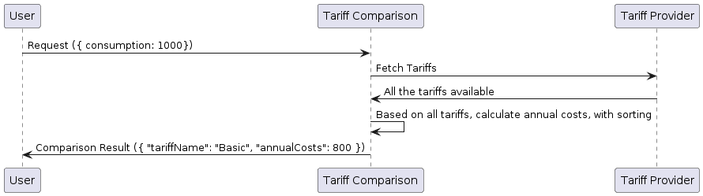

# Tariff Provider Service

A microservice that reads tariffs from a JSON file (`tariffs.json`) and returns the tariffs as a response. This service was created to provide a centralized source of tariff information for other services in our application.


## Functional Requirements

Develop a microservices that 
- reads tariffs from a JSON file (`tariffs.json`),
- accumulates the tariffs in a list,
- and send as response

## Sequence Diagram

The following sequence diagram illustrates the flow of the tariff comparison process:



## Technologies Used

- [Node 20](https://nodejs.org/en)
- [Express](https://expressjs.com/)
- [Docker](https://www.docker.com/)
- [Docker Compose](https://docs.docker.com/reference/cli/docker/compose/)
- [Makefile](https://makefiletutorial.com/)

## Running the Application

1. Clone the repository
2. Navigate to the project directory
3. Install the dependencies: `npm install`
4. Build the Docker image: `docker compose build`
5. Start the service: `docker compose up -d`

**Alternatively**, you can use the Makefile:

```shell
make up
```

## Endpoints

As per functional requirements, the following API endpoints are available:

`GET /`: Get all tariffs

## Sample Response

The following is a sample response from the service which is consumed by the **[Tariff Comparison Service](https://github.com/treadyaparna/verivox-tariff-comparison)**.


```json
[
  {
    "name": "Product A",
    "type": 1,
    "baseCost": 5,
    "additionalKwhCost": 22
  },
  {
    "name": "Product B",
    "type": 2,
    "includedKwh": 4000,
    "baseCost": 800,
    "additionalKwhCost": 30
  }
]
```

## Contact

If you have any questions or feedback, please reach out to me: **Aparna Saha** ([LinkedIn](https://www.linkedin.com/in/aparnasaha/))

## License

This project is licensed under the MIT License (see [LICENSE](LICENSE.md) file).
